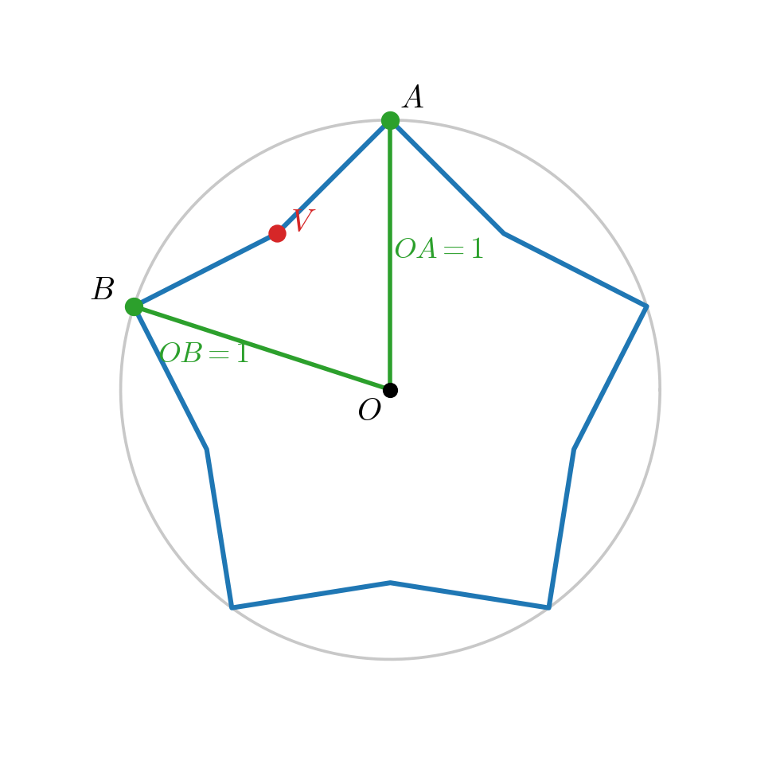
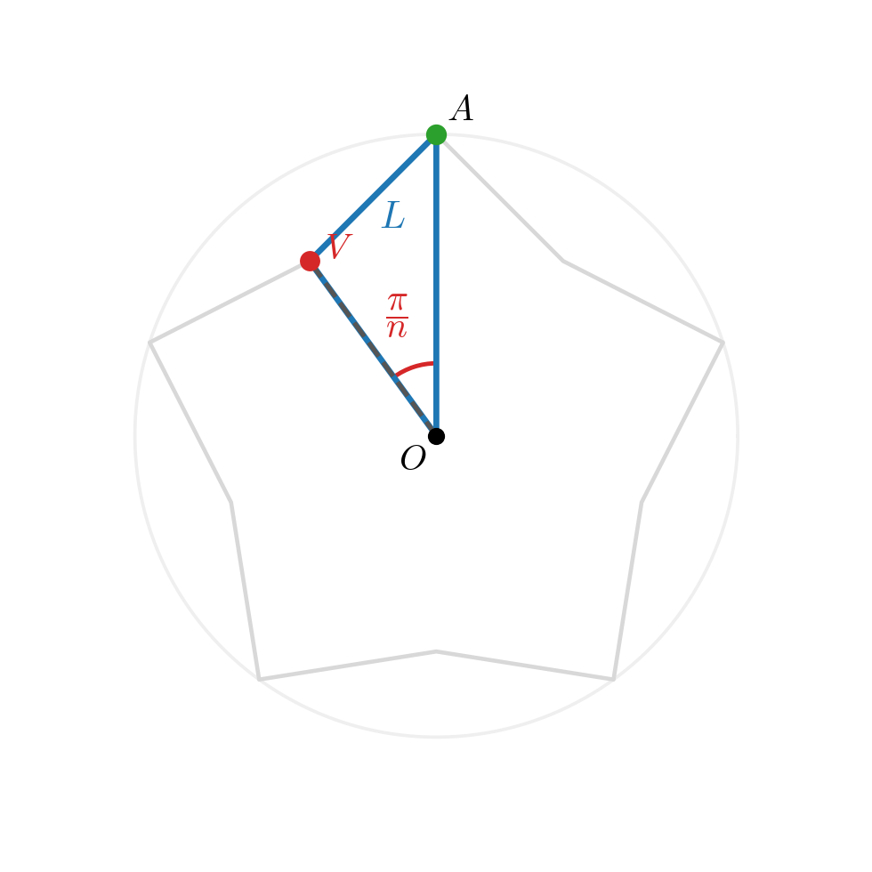
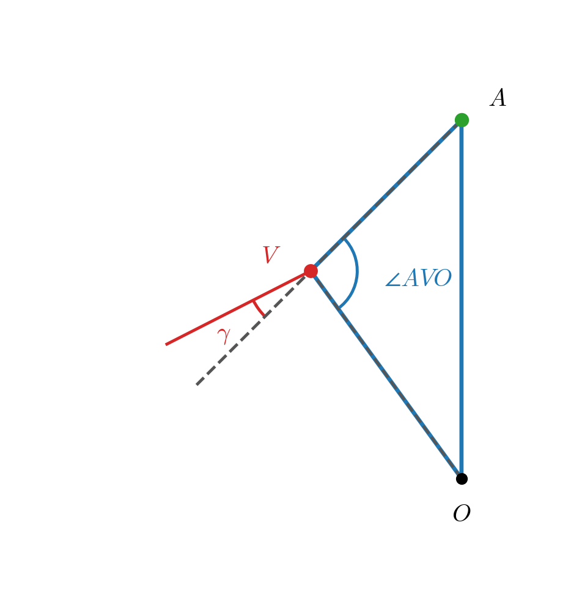

# Derivation for the Star
**Goal:** Find the edge length $L$ for a star with an outer circumradius of $1$.

* Let $O$ be the center. Let $A$ and $B$ be adjacent **outer points**. The distance to the outer points is $OA = OB = 1$.
* Just like the $n$-gon, the central angle between these outer points is $\angle AOB = \frac{2\pi}{n}$.
* Let $V$ be the **inner valley** point located between $A$ and $B$. The line segment $OV$ bisects the central angle perfectly.

* Look at the triangle $OAV$.
    * The side $OA = 1$.
    * The side $AV$ is the edge we are drawing, so $AV = L$.
    * The central angle is $\angle AOV = \frac{\pi}{n}$.
* Now we need the angle at $V$. As the drawing function dictates, the "car" makes a turn at the valley equal to the exterior angle $\gamma = \frac{\pi}{n}(1-s)$.
* Because the turn is $\gamma$, the interior angle of the star at the valley is $\pi - \gamma$.
* The line $OV$ bisects this interior angle, meaning the angle inside our triangle $OAV$ is exactly half of that:
    $$\angle AVO = \frac{\pi - \gamma}{2} = \frac{\pi}{2} - \frac{\gamma}{2}$$

* Apply the **Law of Sines** to triangle $OAV$:
    $$\frac{AV}{\sin(\angle AOV)} = \frac{OA}{\sin(\angle AVO)}$$
* Substitute the known variables:
    $$\frac{L}{\sin(\pi/n)} = \frac{1}{\sin\left(\frac{\pi}{2} - \frac{\gamma}{2}\right)}$$
* Using the trigonometric identity $\sin\!\left(\frac{\pi}{2} - x\right) = \cos(x)$, the denominator on the right side simplifies to $\cos\!\left(\frac{\gamma}{2}\right)$.
* Substitute the half-turn angle $\frac{\gamma}{2} = \frac{(1-s)\pi}{2n}$:
    $$L = \frac{\sin(\pi/n)}{\cos\!\left(\frac{(1-s)\pi}{2n}\right)}$$
